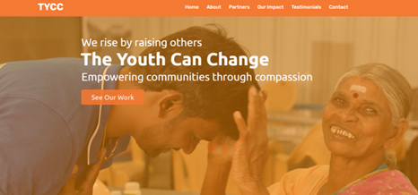

# TYCC - The Youth Can Change | NGO Website

This is a responsive and dynamic website developed during my web development internship for **TYCC (The Youth Can Change)** — an NGO dedicated to youth empowerment and community welfare.

## About the Project

The website showcases TYCC’s mission, impact, community services, and outreach programs. It includes sections like About Us, Partners, Impact Stories, Testimonials, Contact, and an interactive Gallery.

## Features

- Responsive layout (mobile + desktop)
- Smooth scroll and dropdown gallery animation
- Embedded videos and multimedia content
- Testimonials section with carousel
- Contact form with location map
- GitHub-hosted deployment ready
- HTML, CSS, JavaScript, JQuery

## Objective

To create a professional, user-friendly, and modern NGO website that increases community engagement, highlights TYCC’s initiatives, and makes volunteering and support more accessible.

## 🛠Tech Stack

- **Frontend**: HTML5, CSS3, JavaScript, JQuery
- **Tools**: GitHub, VS Code, Google Fonts, Font Awesome
